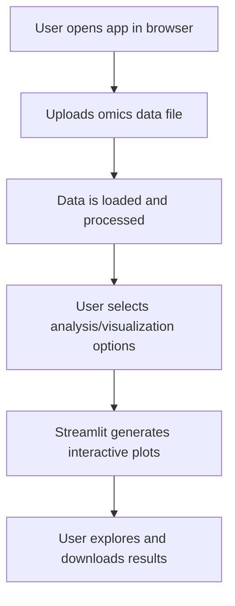

[//]: # (Omics Domain Documentation)

## Omics Domain Background

**Omics** refers to fields of study in biology ending with -omics, such as genomics (study of genomes), transcriptomics (study of RNA transcripts), proteomics (study of proteins), and metabolomics (study of metabolites). Multi-omics integrates data from these domains to provide a comprehensive view of biological systems.

### Common Omics Data Types
- **Genomics:** DNA sequence data, gene variants, SNPs
- **Transcriptomics:** Gene expression matrices (e.g., RNA-Seq counts)
- **Proteomics:** Protein abundance tables, mass spectrometry data
- **Metabolomics:** Metabolite concentration tables

### Example Data Format
Most omics data are provided as tabular files (CSV, TSV, Excel) with rows as features (genes, proteins, etc.) and columns as samples or conditions.

**Example (transcriptomics):**

| Gene   | Sample1 | Sample2 | Sample3 |
|--------|---------|---------|---------|
| TP53   |  120    |  130    |  110    |
| BRCA1  |   80    |   95    |   90    |

### Resources
- [Introduction to Omics Technologies (NCBI)](https://www.ncbi.nlm.nih.gov/pmc/articles/PMC6466120/)
- [Multi-omics Data Integration (Nature)](https://www.nature.com/articles/s41576-018-0017-8)

# Omics Dashboard

A prototype Streamlit app for multi-omics data visualization and exploration.

## Live Demo

[Access the Omics Dashboard App](https://omicsai.streamlit.app)


## Analysis & Methods

The Omics Dashboard provides the following analyses and methods:

### 1. Data Upload & Preview
- Upload CSV/TSV files containing omics data (samples as rows, features as columns).
- Preview the uploaded data and view summary statistics.

### 2. Quality Control
- View basic quality metrics (summary statistics, missing values).
- Visualize feature correlations with a heatmap.
- Outlier detection (planned).

### 3. Exploratory Data Analysis
- **PCA (Principal Component Analysis):** Visualize sample clustering and variance structure in 2D.
- **Scatter Plot:** Interactive scatter plot for any two features.
- **Heatmap:** Correlation heatmap of numeric features.

### 4. Clustering (Unsupervised Learning)
- **KMeans Clustering:** Group samples into clusters based on feature similarity.
- Adjustable number of clusters.

### 5. Classification (Supervised Learning)
- **Random Forest Classifier:** Predict sample classes (e.g., disease/control) using selected features.
- Shows accuracy, confusion matrix, and ROC AUC (for binary classification).

### 6. Feature Selection
- **SelectKBest (ANOVA F-test):** Identify top features most associated with the selected label/class.
- View and download top features and their scores.

### 7. Demo Tab
- Explore a rich, multi-tabbed demo with synthetic data, including advanced visualizations (PCA, heatmap, protein structure, pathway analysis, etc.).

---

**Project Name:** Omics Dashboard  
**Description:**  
A prototype Streamlit app for visualizing and exploring multi-omics data. The dashboard allows users to upload, analyze, and visualize genomics, transcriptomics, proteomics, or metabolomics datasets interactively.

**Key Features:**
- Upload and preview omics data files
- Interactive data visualization (e.g., plots, charts)
- Data filtering and summary statistics
- User-friendly web interface

## Workflow Diagram



## How to Run This Prototype

1. **Clone the repository:**
   ```bash
   git clone https://github.com/justin-mbca/omics_ai.git
   cd omics_ai
   ```

2. **Create and activate a virtual environment:**
   ```bash
   python3 -m venv .venv
   source .venv/bin/activate
   ```

3. **Install the required packages:**
   ```bash
   pip install -r requirements.txt
   ```

4. **Run the application:**
   ```bash
   streamlit run omics_dashboard.py
   ```

5. **Access the app:**
   Open the URL shown in your terminal (e.g., http://localhost:8501 or http://192.168.x.x:8501) in your web browser.

## Deploying Publicly (Free)

You can deploy this app for free using [Streamlit Community Cloud](https://streamlit.io/cloud):

1. Push your code to a public GitHub repository (already done).
2. Go to [Streamlit Cloud](https://streamlit.io/cloud) and sign in with GitHub.
3. Click "New app", select your repo, and set the main file to `omics_dashboard.py`.
4. Click "Deploy".

Your app will be live on a public URL.

---

**Author:** justin-mbca
