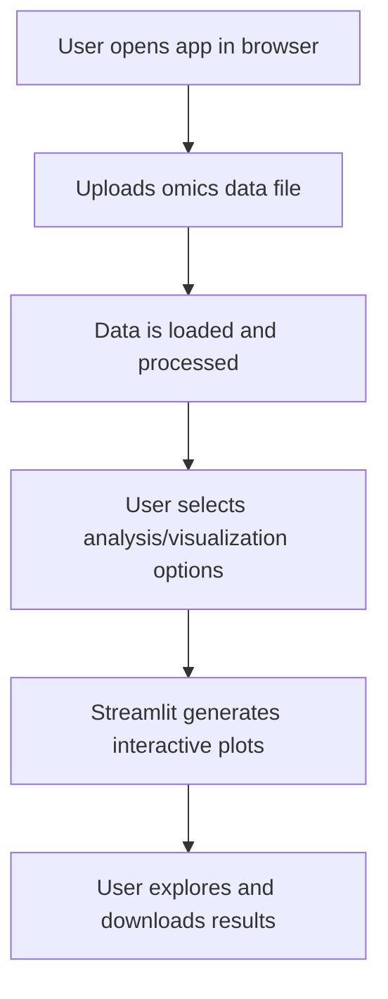

# Omics Dashboard

A prototype Streamlit app for multi-omics data visualization and exploration.

## Project Information

**Project Name:** Omics Dashboard  
**Description:**  
A prototype Streamlit app for visualizing and exploring multi-omics data. The dashboard allows users to upload, analyze, and visualize genomics, transcriptomics, proteomics, or metabolomics datasets interactively.

**Key Features:**
- Upload and preview omics data files
- Interactive data visualization (e.g., plots, charts)
- Data filtering and summary statistics
- User-friendly web interface

## Workflow Diagram



## How to Run This Prototype

1. **Clone the repository:**
   ```bash
   git clone https://github.com/justin-mbca/omics_ai.git
   cd omics_ai
   ```

2. **Create and activate a virtual environment:**
   ```bash
   python3 -m venv .venv
   source .venv/bin/activate
   ```

3. **Install the required packages:**
   ```bash
   pip install -r requirements.txt
   ```

4. **Run the application:**
   ```bash
   streamlit run omics_dashboard.py
   ```

5. **Access the app:**
   Open the URL shown in your terminal (e.g., http://localhost:8501 or http://192.168.x.x:8501) in your web browser.

## Deploying Publicly (Free)

You can deploy this app for free using [Streamlit Community Cloud](https://streamlit.io/cloud):

1. Push your code to a public GitHub repository (already done).
2. Go to [Streamlit Cloud](https://streamlit.io/cloud) and sign in with GitHub.
3. Click "New app", select your repo, and set the main file to `omics_dashboard.py`.
4. Click "Deploy".

Your app will be live on a public URL.

---

**Author:** justin-mbca
