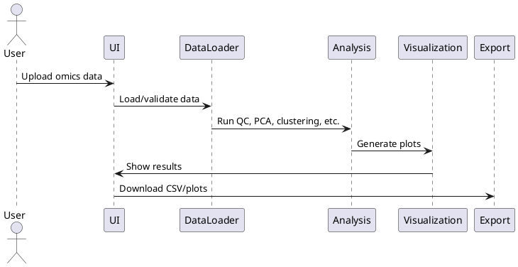

```mermaid
flowchart TD
    A[User] --> B[Streamlit UI]
    B --> C[Data Loader]
    C --> D[Analysis & ML Modules]
    D --> E[Visualization Engine]
    E --> B
    D --> F[Export/Reporting]
    F --> B
    G[Omics Data (CSV/TSV)] --> C
    H[Example Data] --> B
```



---

**Above:**
- **Mermaid Diagram:** Shows the modular architecture and data flow between user, UI, backend modules, and data sources.
- **PlantUML Diagram:** Illustrates the user journey and main system interactions.

> For more diagrams, see the `/docs` folder (planned).
